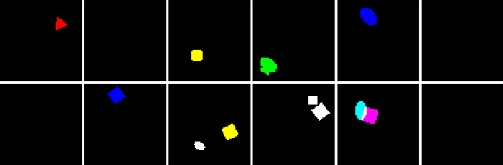

# Multi-object datasets

Tools to generate and use multi-object/multi-sprite datasets.
The datasets consist of images and a dictionary of labels, including the number
of objects in an image, and the attributes of all objects. The attributes are
managed automatically when generating a dataset from a set of sprites, but they 
are dataset-specific so they have to be specified when creating the sprites.

The only requirements are scikit-image (for generation only) and numpy. There are
usage examples in PyTorch.


### Currently available datasets

Datasets are available as `.npz` files in `./generated/`.

#### dSprites<sup id="a1">[1](#f1)</sup>

The datasets consist of binary 64x64 RGB images with monochromatic dSprites on a black canvas. 
Sprites are 18x18 and 7 different colors, and they can overlap (sum and clip).
- 100k images with 1 dSprite per image [10.6 MB]
- 100k images with 0, 1, or 2 (uniformly) sprites per image [11 MB]

#### MNIST

The datasets consist of binary 64x64 single-channel images with MNIST digits on a black canvas.
Digits are rescaled to 18x18 and binarized, and they can overlap (sum and clip).
Only digits from the MNIST training set are used (60k).
- 100k images with 1 digit per image [4.5 MB]
- 100k images with 0, 1, or 2 (uniformly) digits per image [4.8 MB]


### Using a dataset

To use a multi-object dataset:
- get one of the `.npz` datasets provided in `generated/`, or generate one 
yourself (see below for how to do this)
- copy `MultiObjectDataset` and `MultiObjectDataLoader` from 
`multiobject/generic.py` to your codebase
- use the path to the `.npz` dataset when initializing the `MultiObjectDataset`

Basic usage:
```python
train_set = MultiObjectDataset(dataset_path, train=True)
test_set = MultiObjectDataset(dataset_path, train=False)
train_loader = MultiObjectDataLoader(train_set, batch_size=batch_size, shuffle=True)
test_loader = MultiObjectDataLoader(test_set, batch_size=test_batch_size)
```

**Warning**:
For now, the custom DataLoader is not compatible with multiprocessing (`num_workers` > 0). Note that, for small datasets that fit in memory, multiprocessing doesn't really matter anyway.

See the simple VAE demo, and run it like this:
```
CUDA_VISIBLE_DEVICES=0 python demo_vae.py
```


### Generating a dataset

Call `generate_dataset.py` with the desired sprite type as `--type` argument. 
For example, to generate a dSprites dataset, run:
```
python generate_dataset.py --type dsprites
```

To generate a dataset with a new type of sprites:
- create a file `multiobject/sprites/xyz.py` containing a function 
`generate_xyz()`, where "xyz" denotes the new sprite type
- in `generate_dataset.py`, add a call to `generate_xyz()` to generate the
correct sprites, and add `'xyz'` to the list of supported sprites

For now, the following has to be customized in `generate_dataset.py` directly:
- probability distribution over number of objects
- image size
- sprite size
- dataset size
- whether sprites can overlap

### Examples




### Requirements

Tested with (not hard requirements):
```
python 3.6.9
numpy 1.17.2
scikit-image 0.16.2
```

Only necessary to run the examples:
```
pytorch 1.3.1
torchvision 0.4.2
```


### Footnotes

<b id="f1"><sup>1</sup></b> This is actually an extension of the original [dSprites](https://github.com/deepmind/dsprites-dataset)
dataset to many objects and to color images. [↩](#a1)
