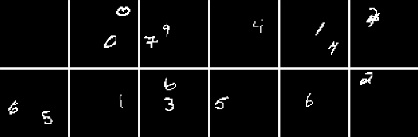

# Multi-object datasets

Tools to generate and use multi-object datasets.
The datasets consist of images and a dictionary of labels, where each image is
labeled with 1) the number of objects in it and 2) each object's attributes. 

Using datasets only requires `numpy` as datasets are `.npz`. 
Generating sprites requires `scikit-image`. Tools for using the
datasets in PyTorch are provided, with usage examples.

## Basic usage (pip package)

1) Either download one of the [datasets](#available-datasets) in `generated/`, 
   or [generate a new one](#generating-a-new-dataset).
2) Place the `.npz` dataset in 
   `/path/to/data/`. 
3) `pip install multiobject`
4) Usage in PyTorch:
	```python
	from multiobject.pytorch import MultiObjectDataLoader, MultiObjectDataset
	dataset_path = '/path/to/data/some_dataset.npz'
	train_set = MultiObjectDataset(dataset_path, train=True)
	test_set = MultiObjectDataset(dataset_path, train=False)
	train_loader = MultiObjectDataLoader(train_set, batch_size=batch_size, shuffle=True)
	test_loader = MultiObjectDataLoader(test_set, batch_size=test_batch_size)
	```


#### Run demos
```
conda create --name multiobject python=3.7
conda activate multiobject
pip install -r requirements.txt
CUDA_VISIBLE_DEVICES=0 python demo_vae.py
CUDA_VISIBLE_DEVICES=0 python demo_count.py
```


## Available datasets

Datasets are available as `.npz` files in `./generated/`.

#### dSprites<sup id="a1">[1](#f1)</sup>

Binary 64x64 RGB images with monochromatic dSprites on a black canvas. 
Sprites are 18x18 and 7 different colors, and they can overlap (sum and clip).
- 100k images with 1 sprite per image [10.6 MB]
- 100k images with 1 sprite per image, larger sprites (max 28x28) [12.4 MB]
- 100k images with 0, 1, or 2 (uniformly) sprites per image [11 MB]


#### Binarized MNIST

Binary 64x64 single-channel images with MNIST digits on a black canvas.
Digits are rescaled to 18x18 and binarized, and they can overlap (sum and clip).
Only digits from the MNIST training set are used (60k).
- 100k images with 1 digit per image [4.5 MB]
- 100k images with 0, 1, or 2 (uniformly) digits per image [4.8 MB]




## Generating a new dataset

1) Clone this repo.

2) See [requirements](#requirements), or set up a virtual environment as follows:
	```
	conda create --name multiobject python=3.7
	conda activate multiobject
	pip install -r requirements.txt
	```

3) Optional: generate a new type of sprites:
	1) create a file `sprites/xyz.py` containing a function 
	`generate_xyz()`, where "xyz" denotes the new sprite type
	2) in `generate_dataset.py`, add a call to `generate_xyz()` to generate the
	correct sprites, and add `'xyz'` to the list of supported sprites

4) Call `generate_dataset.py` with the desired sprite type as `--type` argument. 
Example:
    ```
    python generate_dataset.py --type dsprites
    ```

The sprite attributes are managed automatically when generating a dataset from a set 
of sprites that have per-sprite labels. However, since they are dataset-specific,
they have to be defined when creating the sprites.

**Note.** For now, the following parameters have to be customized in `generate_dataset.py` directly:
- probability distribution over number of objects
- image size
- sprite size
- dataset size
- whether sprites can overlap


## Requirements

To generate datasets:
```
numpy==1.18.1
matplotlib==3.1.2
scikit_image==0.16.2
tqdm==4.41.1
pillow==7.0.0
```

To run the examples or use the pytorch tools:
```
torch==1.4.0
torchvision==0.5.0
```


## Footnotes

<b id="f1"><sup>1</sup></b> This is actually an extension of the original [dSprites](https://github.com/deepmind/dsprites-dataset)
dataset to many objects and to color images. [↩](#a1)
