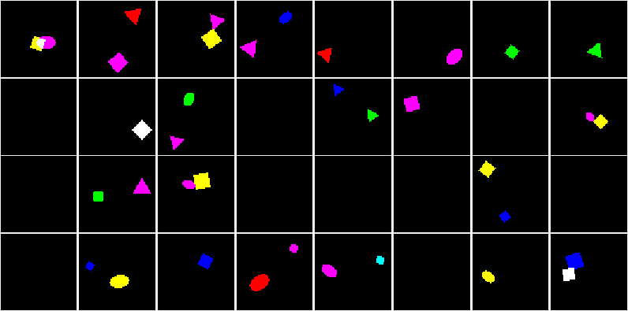

# Multi-object datasets

Tools to generate and use multi-object/multi-sprite datasets.
The datasets consist of images and a dictionary of labels, including the number
of objects in an image, and the attributes of all objects. The attributes are
dataset-specific.

Currently available datasets in `generated/`:
- 100k binary 64x64 RGB images with 1 dSprite<sup id="a1">[1](#f1)</sup> per 
image on a black canvas, where sprites have 7 colors
- 100k binary 64x64 RGB images with 0, 1, or 2 (uniformly) dSprites per image on 
a black canvas, where sprites have 7 colors


### Using a dataset

To use a multi-object dataset:
- get one of the `.npz` datasets provided in `generated/`, or generate one yourself (see below 
for how to do that)
- copy the dataset `MultiObjectDataset` and dataloader `MultiObjectDataLoader`
from `multiobject/generic.py` to your codebase
- use the path to the `.npz` dataset when initializing the `MultiObjectDataset`

See the simple VAE demo and run it:
```
CUDA_VISIBLE_DEVICES=0 python demo_vae_dsprites.py
```


### Generating a dataset

Call `generate_dataset.py` with the desired sprite type as `--type` argument. 
For example, to generate a dSprites dataset, run:
```
python generate_dataset.py --type dsprites
```



To generate a dataset with a different type of sprites:
- create a file `multiobject/sprites/xyz.py` containing a function 
`generate_xyz()`, where "xyz" denotes the new type
- in `generate_dataset.py`, add a call to `generate_xyz()` to generate the
correct sprites, and add `'xyz'` to the list of supported sprites

For now the following has to be customized in `generate_dataset.py` directly:
- probability distribution over number of objects
- image size
- sprite size
- dataset size
- whether sprites can overlap


### Requirements

Tested with:
```
python 3.6.9
numpy 1.17.2
matplotlib 3.1.1
pytorch 1.3.1
scikit-image 0.16.2
```


<b id="f1"><sup>1</sup></b> This is actually an extension of the original [dSprites](https://github.com/deepmind/dsprites-dataset)
dataset to many objects and to color images. [↩](#a1)
